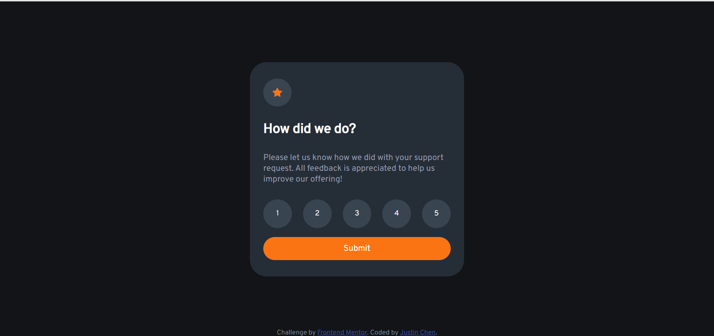
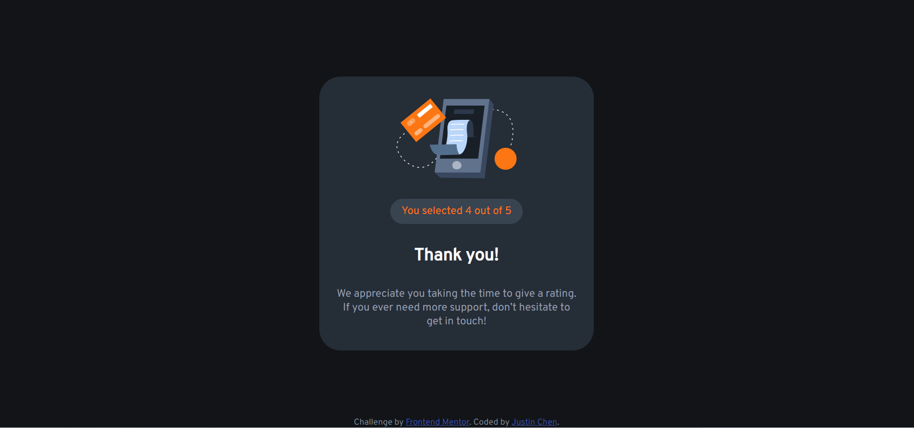
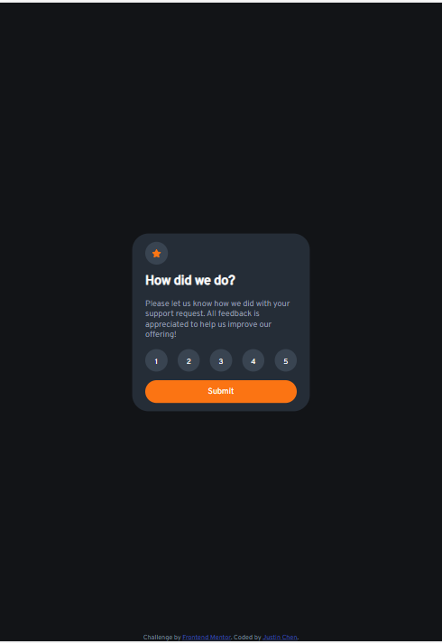
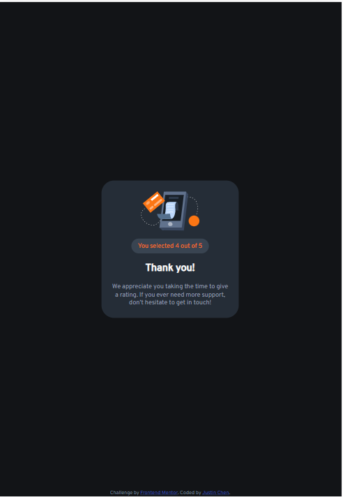
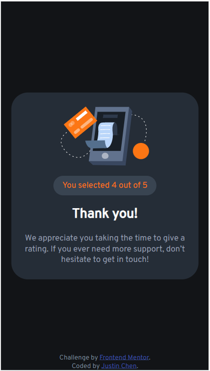

# Frontend Mentor - Interactive rating component solution

This is a solution to the [Interactive rating component challenge on Frontend Mentor](https://www.frontendmentor.io/challenges/interactive-rating-component-koxpeBUmI). Frontend Mentor challenges help you improve your coding skills by building realistic projects. 

## Table of contents

- [Overview](#overview)
  - [The challenge](#the-challenge)
  - [Screenshot](#screenshot)
  - [Links](#links)
- [My process](#my-process)
  - [Built with](#built-with)
  - [What I learned](#what-i-learned)
  - [Continued development](#continued-development)
  - [Useful resources](#useful-resources)
- [Author](#author)

## Overview

### The challenge

Users should be able to:

- View the optimal layout for the app depending on their device's screen size
- See hover states for all interactive elements on the page
- Select and submit a number rating
- See the "Thank you" card state after submitting a rating

### Screenshot








### Links

- Solution URL: [Github](https://github.com/jjustin-35/interactive-rating-component-main)
- Live Site URL: [Live site](https://jjustin-35.github.io/interactive-rating-component-main/)

## My process

### Built with

- HTML5
- Semantic HTML5 markup
- CSS
- SCSS
- Flexbox
- JavaScript

### What I learned

I learned how to make a function of make rating buttons changing color. If customers move their mouse over the button of rating at 4, not only the 4 button but also the 1~3 button will also change their color.

To made this function, I learn the logic to use the DOM skill to deal with the mouseover, click, and the mouseout event. see below:

```js
let ratingBtn = document.querySelectorAll('div#ratingBtn input')
let scoreBoard = document.querySelector('p#score span')

// 1. mouseover
ratingBtn.forEach((element, i) => {
    element.addEventListener('mouseover', () => {
        // reset star
        ratingBtn.forEach((elem) => {
            elem.style = '';
        })
        // add the style to the current element & the element in front of current element.
        for (let j = 0; j <= i; j++){
            ratingBtn[j].style = 
                `
                background-color: hsl(25, 97%, 53%);
                color: white;
                `
        }
    })

    let index;
    //2. click
    element.addEventListener('click', () => {
        index = i;
        let score = index + 1;
        scoreBoard.innerHTML = score;
    })

    //3. mouseout
    element.addEventListener('mouseout', () => {
        ratingBtn.forEach((elem) => {
            elem.style = '';
        })
        for (let j = 0; j <= index; j++){
            ratingBtn[j].style = 
                `
                background-color: hsl(25, 97%, 53%);
                color: white;
                `
        }
    })
})
}
```

### Continued development

I think that making RWD by CSS is a little bit difficult, since the adjustment to fit the device size is hard to do well. I still need to spend a lot of time to make sure it's fit the smartphone screen.  I think I should try to use Bootstrap to design the website, that maybe can make it easier.
Besides, I should learn more about the framework such as Jquery, React, to make it much better.

### Useful resources

- [star rating system](https://b0444135.medium.com/html-star-rating-%E8%A9%95%E5%88%86%E7%B3%BB%E7%B5%B1star-rating-system-in-html-css-javascript-6af371079dc9) - This is an amazing article which helped me finally understand the concept of making rating system. I'd recommend it to anyone still learning this concept

## Author

- Website - [Justin Chen](https://github.com/jjustin-35/)
- Frontend Mentor - [@jjustin-35](https://www.frontendmentor.io/profile/jjustin-35)
- Twitter - [@e\Vmd7EMdBkFjSEZz](https://twitter.com/Vmd7EMdBkFjSEZz)
